```{r setup}
#| include: false
library(dplyr)
library(readr)
library(tidyr)
library(knitr)

d <- function(f) read_csv(file.path("data", f), show_col_types = FALSE)

sub_scores <- d("scores_by_subsample.csv")
rnd_scores <- d("scores_by_round.csv")
incl       <- d("inclusion_probs.csv")
calendar   <- d("release_calendar.csv")
labels     <- d("series_labels.csv")
manifest   <- d("series_manifest.csv")
live       <- d("live_density_quantiles.csv")

CORE   <- c("GIGG-SV-trend", "GIGG-SV", "GIGG", "PCA-MIDAS", "DFM")
PANELS <- c("GIGG-SV", "GIGG-SV (+financial)", "GIGG-SV (+foreign)")

# Every number quoted in the text is pulled from these files rather than typed in.
val <- function(spec, subsample, metric) {
  sub_scores %>%
    filter(spec == !!spec, subsample == !!subsample) %>%
    pull(!!sym(metric)) %>% round(3)
}
```

# Purpose

@kohns2025midas develop a Bayesian mixed-data-sampling framework that combines group-shrinkage priors for MIDAS problems, allows for estimation of slow-moving stochastic trends and stochastic volatilities with flexible hierarchical priors, and remains interpretable to the nowcaster due to the post-estimation sparsification algorithm which informs on variable importance over the nowcast cycle.. The accompanying estimation code is released as the BMIDAS-GIGG toolbox [@bmidasgigg].

So far this framework has been applied only to the UK data. Small open economies such as Estonia differ from the United Kingdom in the composition of their indicator sets, in the length of their reliable statistical record (which tends to start reliably typically in the early 2000's), and in the size of the shocks that the trend and volatility components absorb. Hence, in this case study, we put the Bayesian machinery of @kohns2025midas to the test by applying it to nowcasting Estonian q-o-q real GDP growth.

This case study has three aims.

1.  Build a dataset suitable for nowcasting Estonian macroeconomic activity, assembled directly from source APIs, and archived as real-time vintages so that genuine real-time exercises become possible with time. While this post covers mostly methodology and initial results, a webpage is in the works access to the data.
2.  Provide a suite of publicly accessible models with a continually updated performance benchmark, so that the comparison between model classes is reproducible.
3.  Use the results to identify modelling avenues and to document what the estimates imply about Estonian macroeconomic dynamics.

The code for the data pipeline, the model drivers and every figure below is available will be made available soon.

# Data description

## Coverage

The core dataset contains eleven monthly indicators in four groups. Survey indicators cover manufacturing, construction and retail confidence together with consumer confidence and consumer price expectations. Real Activity is represented by the industrial production volume index and by accommodated tourists. Prices enter through the consumer and producer price indices. Energy enters through electricity and heat production. The target is quarterly GDP growth, chain-linked volume, seasonally and working-day adjusted.

The selection follows the standard nowcasting practice summarised in @banbura2013nowcasting, which is to combine a small set of timely soft indicators with the hard series that the target is mechanically related to. Survey balances are included because they are the only monthly series published within their own reference month, so they carry the entire information set in the earliest rounds of the release cycle. Industrial production is the single most important hard indicator for Estonia, where manufacturing dominates the goods-export base, and it is the series that the group prior selects most often at the end of the cycle. Consumer and producer prices enter as nominal counterparts that are considerably more timely than the volume data, a role documented for mixed-frequency models in @ghysels2020mixed. Electricity and heat production are high-frequency physical proxies for aggregate activity with a short publication delay. Accommodated tourists proxy the services side, which is otherwise unrepresented at monthly frequency because Estonia's services turnover index only begins in 2020.

Two further blocks are introduced in @sec-extending. Financial market data are drawn from the European Central Bank Data Portal. Foreign activity is summarised by a single export-weighted index of industrial confidence in Estonia's four largest goods-export destinations.

```{r var-table}
#| label: tbl-variables
#| tbl-cap: "Indicators, sources and coverage. Group codes are SUR surveys, ACT real activity, PRI prices, ENE energy, FIN financial, FOR foreign. Panel indicates the indicator set in which each series is used."
core_series <- c("BCI_MANUF","BCI_CONSTR","BCI_RETAIL","CCI","CONS_PRICE_EXP",
                 "IP","TOURISTS","CPI","PPI","ELEC_PROD","HEAT_PROD")
fin_series  <- c("STOXX","EURIBOR3M","TERMSPREAD","EURUSD","LEND_RATE_EE")
for_series  <- c("FOREIGN_ICI")

panel_of <- function(s) case_when(s %in% core_series ~ "core",
                                  s %in% fin_series  ~ "financial",
                                  s %in% for_series  ~ "foreign")

# Economic grouping, which is also the grouping the GIGG prior shrinks over.
GROUPS <- c(BCI_MANUF = "SUR", BCI_CONSTR = "SUR", BCI_RETAIL = "SUR", CCI = "SUR",
            CONS_PRICE_EXP = "SUR", IP = "ACT", TOURISTS = "ACT",
            CPI = "PRI", PPI = "PRI", ELEC_PROD = "ENE", HEAT_PROD = "ENE",
            STOXX = "FIN", EURIBOR3M = "FIN", TERMSPREAD = "FIN", EURUSD = "FIN",
            LEND_RATE_EE = "FIN", FOREIGN_ICI = "FOR")

tibble(series = c(core_series, fin_series, for_series)) %>%
  mutate(panel = panel_of(series)) %>%
  left_join(labels %>% distinct(series, .keep_all = TRUE), by = "series") %>%
  left_join(manifest %>% select(series, first_obs, last_obs), by = "series") %>%
  mutate(
    source = case_when(
      series == "FOREIGN_ICI" ~ "Eurostat, export-weighted",
      series == "TERMSPREAD"  ~ "ECB, derived",
      TRUE ~ recode(source, statee = "Statistics Estonia", ecb = "ECB Data Portal",
                    eurostat = "Eurostat", oecd = "OECD")),
    first_obs = format(as.Date(first_obs), "%Y-%m"),
    last_obs  = format(as.Date(last_obs),  "%Y-%m")) %>%
  # TERMSPREAD and FOREIGN_ICI are derived inside the export step rather than fetched, so
  # they carry no registry row. Their spans are the intersection of their inputs.
  mutate(group = GROUPS[series],
         table     = coalesce(table, c(TERMSPREAD = "FM", FOREIGN_ICI = "ei_bssi_m_r2")[series]),
         first_obs = coalesce(first_obs, c(TERMSPREAD = "1994-01", FOREIGN_ICI = "2000-01")[series]),
         last_obs  = coalesce(last_obs,  c(TERMSPREAD = "2026-07", FOREIGN_ICI = "2026-07")[series])) %>%
  select(Series = series, Group = group, Panel = panel, Source = source, Table = table,
         From = first_obs, To = last_obs) %>%
  kable()
```

Seasonal adjustment is handled series by series and the treatment differs across the panel. Industrial production is calendar and seasonally adjusted by Statistics Estonia at source and is passed through unchanged. Tourists, the consumer and producer price indices, and electricity and heat production are published unadjusted, and we adjust them ourselves by seasonal-trend decomposition using loess. The survey balances are also adjusted by us rather than at source, for the reason set out below. Financial series and the foreign activity index are not adjusted in the pipeline, the former because financial prices carry no seasonal, the latter because Eurostat publishes it already adjusted.

The provenance of the survey balances changed during this project. They were originally pulled from the OECD short-term statistics feed, which stops in April 2026. They are now assembled from the unadjusted Eurostat history joined to the Statistics Estonia BAR tables, which is the arrangement described next.

One data quirk requires separate treatment. Estonia's business and consumer survey moved from the Estonian Institute of Economic Research to Statistics Estonia in May 2026, and publication of the Estonian data by the European Commission has been suspended in the interim. The historical and current halves therefore come from different producers and there is no overlap on which to calibrate the joint series. Both halves are taken unadjusted, and a single pass of X-13ARIMA-SEATS with a user-specified level shift at the break performs the seasonal adjustment and the level correction on one consistent basis. The level shift is estimated from very few post-break observations, so the recent survey values carry more uncertainty than the historical ones.

## Stylised release calendar

Since the model suite we propose in @kohns2025midas is based on the MIDAS methodology, which is a direct nowcasting technique, the models are re-estimates at the identified data publication days within each nowcast cycle. In our case, we stylise this release calendar to fifteen points inside each quarter. At each point the model observes only what would genuinely have been published by then. The publication delay records how many months after a reference month an observation appears, where zero means within the reference month itself. The slot orders publications inside a month.

```{r calendar}
#| label: tbl-calendar
#| tbl-cap: "Stylised release calendar. Cells give the number of monthly lags observed at each release round. Column headers give the round, the calendar month it falls in relative to the target quarter t, and the approximate number of days before the GDP flash release."
# Round to calendar position, verified against the emission order of calendar_gen in the
# toolbox. The first three months of the target quarter carry four rounds each and the
# month after the quarter ends carries three, because the surveys are complete by then and
# so trigger no further round. Days are measured from the start of the round's month to the
# flash release, which arrives about 29 days after the quarter ends. Within-month ordering
# is stylised, so a finer day count would be spurious precision.
round_pos <- tibble(
  round = 1:15,
  month = c(rep("t M1", 4), rep("t M2", 4), rep("t M3", 4), rep("t+1 M1", 3)),
  days_before_flash = c(rep(120, 4), rep(90, 4), rep(60, 4), rep(29, 3)))

hdr <- paste0("r", round_pos$round, " (", round_pos$month, ", ",
              round_pos$days_before_flash, "d)")

calendar %>%
  rename(Indicator = indicator, Delay = pubdelay, Slot = pubseq) %>%
  rename_with(~ hdr, starts_with("r")) %>%
  kable()
```

Your reading is the correct one. The model carries six monthly lags of each indicator, which happens to span the three months of the quarter being nowcast and the three of the quarter before it. Availability in @tbl-calendar is counted out of those six lags.

Surveys are published without any delay and all six lags are available by round nine. Industrial production, with its two-month delay, has only one lag available at round one and still only five at round fifteen. The third month of the target quarter is therefore never observed for hard activity before the GDP flash estimate arrives, which is the informational problem the model exists to address.

Two features of @tbl-calendar deserve comment. Survey balances carry a delay of zero because Statistics Estonia now publishes within the reference month, on the twenty-third. The quarterly target carries a delay of minus one because we consider the flash estimate to be the target for estimation. Since the flash estimate is not available for the entire evaluation period considered, we use the final vintages of GDP where available (until 2025) and use the flash estimates for GDP values of Q1-Q2 2026.

### Estimation and evaluation windows

```{r sample-table}
#| label: tbl-sample
#| tbl-cap: "Estimation and evaluation windows."
tibble(
  Item = c("Monthly sample", "Quarterly sample", "First nowcast quarter",
           "Training quarters before the first nowcast", "Evaluation quarters",
           "Release rounds per quarter", "Monthly lags", "Scored through",
           "Conditioning only, not scored"),
  Value = c("2000M01 to 2026M09", "2000Q1 to 2026Q3", "2008Q1",
            "31", "74", "15", "6", "2025Q4",
            "2026Q1 to 2026Q3")
) %>% kable()
```

The estimation window expands. At each evaluation quarter the model is re-estimated on all data up to that quarter, and then filtered through each of the fifteen release rounds. Nothing after the quarter being nowcast enters the estimation sample.

The last three quarters require a separate convention. Their outturn is either a flash estimate or not yet published, so they are used as conditioning information for the live nowcast but are excluded from every score reported below. Mixing a first-release vintage into the scored sample would compare models against a target that is itself subject to revision, and over the sixteen quarters where both are available the flash and the final vintage differ by an average of one percentage point on a year-on-year basis.

@fig-calendar summarises the same information visually, with indicators grouped by their release group. The block structure is the point. Surveys are dark from the first round, prices fill in from the middle of the cycle, and real activity remains incomplete throughout.

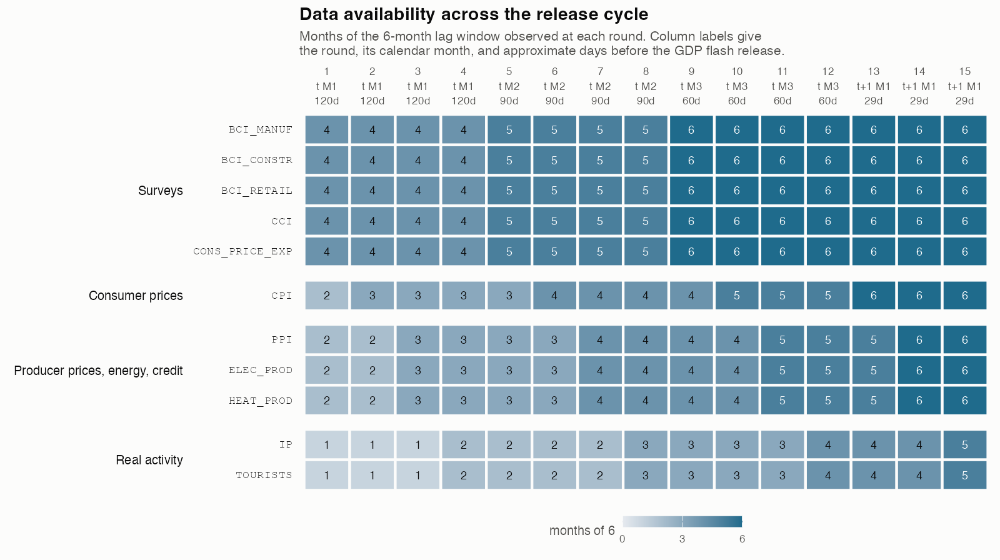{#fig-calendar}

## Missing observations

Missing values arise in three ways. Producer prices begin in 2002 and require backfilling over 2000 and 2001. Trade series begin in 2004, when Intrastat replaced customs collection on accession to the European Union. Financial series contain scattered gaps where the underlying return was suppressed for confidentiality.

The toolbox imputes missing entries by principal-components expectation maximisation on the monthly panel before the release calendar is applied, following @stock2002macroeconomic, with the treatment of arbitrary missing patterns as in @banbura2014maximum. Since the evaluation period begins after any missing values existence, imputed values are never used for nowcast evaluation. Imputed cells that predate the first evaluation quarter still shape the parameter estimates of the early expanding-window fits, and the trade and financial blocks should be read with that in mind.

# Model description

## The BMIDAS-GIGG model

Let $y_t$ denote quarterly GDP growth in quarter $t$ and let $x^{(m)}_{i,t}$ denote monthly indicator $i$ at monthly lag $m = 0, \dots, M-1$ within the window, with $m = 0$ the most recent month. The observation equation is

$$
y_t = \tau_t + \sum_{i=1}^{K} \sum_{m=1}^{M} \beta_{i,m}\, x_{i,t}^{(m)} + \varepsilon_t,
\qquad \varepsilon_t \sim N\!\left(0, e^{h_t}\right),
$$ {#eq-obs}

with a random-walk trend and a random-walk log-variance,

$$
\tau_t = \tau_{t-1} + \exp(g_t/2)\,\eta_t, \qquad
g_t = g_{t-1} + \omega_g\, \zeta_t, \qquad
h_t = h_{t-1} + \omega_h\, \nu_t, \qquad
\eta_t, \zeta_t, \nu_t \sim N(0,1).
$$ {#eq-states}

Here $\tau_t$ is the stochastic trend, $h_t$ the log-variance of the observation equation, and $g_t$ the log-variance of the trend innovation, so the trend itself is allowed to move at a time-varying rate. The scale parameters $\omega_g$ and $\omega_h$ govern how much time variation the trend and the volatility admit, and the model nests a static trend at $\omega_g = 0$ and a homoskedastic observation equation at $\omega_h = 0$. This case study places penalised complexity priors [@simpson2017penalising] on both, in the non-centred parameterisation of @eq-states. The penalised complexity prior places an exponential penalty on the Kullback-Leibler distance from the simpler model in which the scale is zero, which is a static trend and a homoskedastic observation equation. This shrinks toward the simpler model without bounding the scale away from zero, which is the failure mode of the conditionally conjugate inverse-gamma alternative.

The regression coefficients receive the group inverse-Gamma gamma prior (GIGG) as proposed in @kohns2025midas . Each indicator forms a group (of lags), to which 3-tiered hierarchical shrinkage is applied: 1) on the entire collection of groups, i.e., global shrinkage, 2) on the indicator group level, shrinking the collection of monthly lags jointly, 3) on the lag level which allows to estimate how correlated individual and group-wise shrinkage is. @kohns2025midas show that this prior significantly improves inference and nowcasting compared to popular shrinkage priors. Writing $\beta_{(i)}$ for the coefficient block of indicator $i$, the prior takes the following form:

$$
\beta_{(i)} \mid \gamma_i, \lambda_{i,m} \sim
N\!\left(0, \gamma_i \operatorname{diag}(\lambda_{i,1},\dots,\lambda_{i,M})\right),
\qquad
\gamma_i \sim \mathrm{Ga}(a_g, 1), \qquad
\lambda_{i,m} \sim \mathrm{IG}(b_g, 1).
$$ {#eq-gigg}

While it would be possible to set the hyperparameters $(a_g,b_g)$ for each indicator separately, we follow the recommendations of @kohns2025midas by estimating $a_g$ via a hierarchical prior and set $b_g=0.5$ in order to push the posterior on $\beta_{(i)}$ toward high intra group correlation.

The group scale $\gamma_i$ controls whether an indicator enters at all and the local scales $\lambda_{i,m}$ control the shape of its lag profile. Finally, posterior draws are then sparsified by group signal-adaptive variable selection proposed in @kohns2025midas, which maps the continuous posterior to a set of exact zeros and yields the inclusion probabilities reported in @sec-inclusion. This allows interpreting the high-dimensional poster in terms of which indicator is most probably to influence the predictions.

## The lag polynomial

An unrestricted specification assigns one coefficient to every indicator and lag, which here would be sixty-six coefficients for eleven indicators over six months. The Almon restriction [@almon1965] replaces the free lag profile with a low-order polynomial which is gradient and end point restricted peter out smoothly to zero with the last lag. The restriction imposes smoothness within an indicator's lag profile and is the reason the group structure in @eq-gigg has two members per group rather than six.

Concretely, the coefficient on lag $m$ of indicator $i$ is written as a polynomial in the lag index,

$$
\beta_{i,m} = \sum_{j=1}^{P} \theta_{i,j}\, w_j(m),
\qquad
w_j(m) = m^{\,j+1} + j\,(M-1)^{\,j+1} - (j+1)\,(M-1)^{\,j} m ,
$$ {#eq-almon}

where $M$ is the number of monthly lags and $P$ is the polynomial degree net of the restrictions. The basis in @eq-almon is constructed so that

$$
w_j(M-1) = 0
\qquad\text{and}\qquad
w_j'(M-1) = 0
\qquad\text{for every } j ,
$$ {#eq-almon-restrictions}

which are the endpoint and gradient restrictions. The coefficient on the most distant lag is zero and the profile approaches it with zero slope, so the lag structure tapers off smoothly rather than being truncated. With $M = 6$ and a third-degree polynomial, two restrictions leave $P = 2$ free parameters $\theta_{i,1}$ and $\theta_{i,2}$ per indicator, which is why each group in @eq-gigg has two members.

The practical consequence is that the prior shrinks a shape rather than six unrelated numbers. @fig-almon shows the two basis functions and a set of admissible profiles. The restriction is not as tight as it first appears. Combinations of the two functions deliver monotone decay at different speeds, sign reversals, and hump-shaped profiles that peak one or two months back, which is the shape one would expect for an indicator that leads the target.

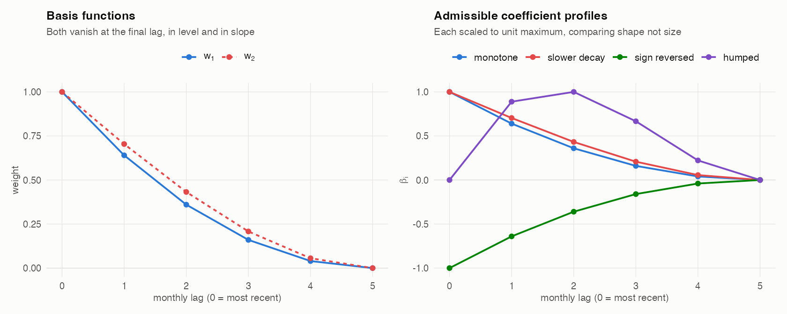{#fig-almon}

## Model Overview

```{r model-table}
#| label: tbl-models
#| tbl-cap: "Estimated specifications. All BMIDAS variants use the Almon restriction and six monthly lags."
tibble(
  Model = c("GIGG-SV-trend", "GIGG-SV", "GIGG", "PCA-MIDAS", "DFM"),
  Trend = c("random walk, PC prior", "none", "none", "none", "random walk"),
  `Observation volatility` = c("stochastic, PC prior", "stochastic, PC prior",
                               "homoskedastic", "homoskedastic", "stochastic"),
  `Lag treatment` = c("Almon", "Almon", "Almon", "principal components",
                      "state-space aggregation"),
  Shrinkage = c("GIGG", "GIGG", "GIGG", "GIGG on components, no sparsification", "none")
) %>% kable()
```

We test three GIGG-MIDAS variants which form a nested sequence of model components. GIGG-SV-trend includes a stochastic trend and stochastic volatility $(h_t,g_t)$, GIGG-SV drops the trend $(g_t = 0)$, and GIGG drops both $(g_t = h_t = 0)$.

Two models from outside the framework serve as comparators.

**PCA-MIDAS** takes the unrestricted MIDAS design of every monthly lag available at a given release round and replaces it with its leading four principal components, recomputed at every round and every estimation window on that window's data alone. The components are extracted from the correlation matrix, because the design mixes percentage changes with standardised survey balances and an unstandardised extraction would track whichever block carries the larger variance. No trend and no stochastic volatility are applied. The approach is the factor-MIDAS of @marcellino2010factor, which extracts principal components from a ragged-edge monthly panel and regresses the quarterly target on them, and it is closely related to the daily-frequency factor constructions of @andreou2013should.

We do not sparsify the component loadings. Doing so was tested and it degenerates. Group sparsification is a statement about which indicators enter, and once the regressors are principal components there are no indicator groups left to select. Applied to the loadings it drives the inclusion numbers to between 0.00 and 0.04 at every round, and the correlation between the nowcast and the outturn falls from 0.385 to 0.094. The sparsified variant attains a marginally lower root mean squared error only because it forecasts close to a constant, which is not an improvement worth reporting. PCA-MIDAS therefore has no inclusion probabilities to show, and it is omitted from @fig-incl-core.

**DFM** is the Bayesian dynamic factor model of the Federal Reserve Bank of New York [@nyfednowcast], following @antolindiaz2024 and in the tradition of @banbura2013nowcasting. Similar to the full GIGG-MIDAS model, estimates a random-walk trend in mean, and stochastic volatility, however for both the factor and the idiosyncratic innovations. Additionally, it includes estimation of a discrete outlier term which @antolindiaz2024 have shows to significantly improve computational stability when outliers are contained in the data set, as well as improve nowcasting performance during crisis times. The DFM frameworks largest departure from the MIDAS framework is that it estimates the model at the lowest available frequency, here the monthly frequency, and uses the joint model over indicators and the target to interpolate any missing data at time of estimation with the system. While convenient for drawing inference on unobservable targets such as monthly GDP, the previous literature has shows that whether the DFM or MIDAS framework dominates, is often a factor of the available time-series length (often the DFM requires many more observations in order to enable accurate inference on unknown states) as well as whether the data generating process for the target is truly sparse or dense. In the latter case, it has been shown (@giannone2021economic) that factor and dynamic factor models can outperform shrinkage methods, while in the former case, estimating with shrinkage priors can outperform (additionally mutli-step ahead forecasts are often better with the full system DFM models compared to MIDAS models). Quarterly aggregation follows the Mariano-Murasawa weighting. It is estimated on the same eleven indicators and filtered through the same release calendar, so the information sets are identical by construction.

# Core results {#sec-core}

The evaluation covers seventy-four quarters from 2008Q1, with thirty-one quarters of training data before the first nowcast. Subsamples are the global financial crisis to the end of 2009, a tranquil period from 2010 to 2019, and the pandemic period from 2020. Quarters whose outturn is available only as a flash estimate are used as conditioning information.

Three scores are reported. Write $y_t$ for the outturn, $\hat{y}_t$ for the predictive median and $F_t$ for the predictive distribution function at quarter $t$.

The root mean squared forecast error evaluates the point forecast only,

$$
\mathrm{RMSFE} = \sqrt{\tfrac{1}{T}\textstyle\sum_{t=1}^{T}\left(y_t - \hat{y}_t\right)^2 }.
$$ {#eq-rmsfe}

The continuous ranked probability score evaluates the whole density and reduces to the absolute error when the forecast is a point mass,

$$
\mathrm{CRPS}_t = \int_{-\infty}^{\infty}\left(F_t(z) - \mathbf{1}\{z \ge y_t\}\right)^2 dz .
$$ {#eq-crps}

The tail-weighted quantile score is a weighted sum of pinball losses over a grid of quantiles $\alpha$, with weights that emphasise the tails,

$$
\mathrm{WQS}_t = \sum_{\alpha} v(\alpha)\left(\alpha - \mathbf{1}\{y_t < F_t^{-1}(\alpha)\}\right)\left(y_t - F_t^{-1}(\alpha)\right),
\qquad v(\alpha) = \left(2\alpha - 1\right)^2 .
$$ {#eq-wqs}

All three are negatively oriented, so lower is better throughout. The CRPS and the WQS are proper scoring rules in the sense of @gneiting2007strictly, so they are minimised in expectation by the true predictive distribution. The RMSFE rewards only the central tendency, which is why a model can improve on it while worsening the density, and the two scores disagree in exactly that way below.

## Accuracy across the release cycle

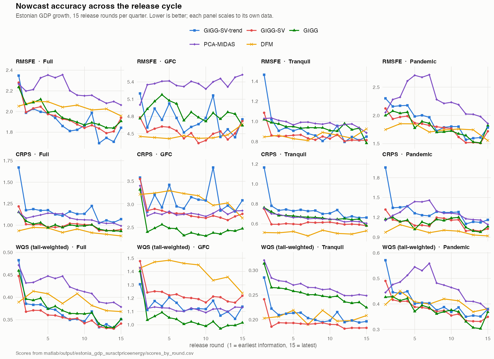{#fig-scores-core}

```{r core-scores}
#| label: tbl-core
#| tbl-cap: "Scores averaged over release rounds. Lower is better."
sub_scores %>%
  filter(spec %in% CORE, subsample %in% c("Full","GFC","Tranquil","Pandemic")) %>%
  select(spec, subsample, rmsfe, crps, wqs) %>%
  pivot_longer(c(rmsfe, crps, wqs), names_to = "metric") %>%
  mutate(metric = recode(metric, rmsfe = "RMSFE", crps = "CRPS", wqs = "WQS"),
         value = round(value, 3)) %>%
  pivot_wider(names_from = subsample, values_from = value) %>%
  arrange(factor(metric, levels = c("RMSFE","CRPS","WQS")),
          factor(spec, levels = CORE)) %>%
  rename(Model = spec, Metric = metric) %>%
  kable()
```

```{r dm-table}
#| label: tbl-dm
#| tbl-cap: "Scores relative to the GIGG benchmark. Values below one indicate an improvement and are shown in bold. Significance is from the Diebold-Mariano test with the Harvey-Leybourne-Newbold correction, on the same loss differentials the toolbox uses, with * p<0.10, ** p<0.05, *** p<0.01. Bare stars mark significant improvements and stars in parentheses mark significant deteriorations."
dm <- d("dm_vs_benchmark.csv")

# The toolbox convention stars improvements only. Reporting deteriorations unmarked would
# be misleading here, because several are significant at well below the one per cent level.
# They are marked in parentheses.
sig <- function(p) ifelse(is.na(p), "", ifelse(p < 0.01, "***", ifelse(p < 0.05, "**",
                   ifelse(p < 0.10, "*", ""))))
fmt <- function(ratio, pval) {
  mark <- sig(pval)
  ifelse(is.na(ratio), "",
    ifelse(ratio < 1,
           paste0("<strong>", sprintf("%.3f", ratio), mark, "</strong>"),
           paste0(sprintf("%.3f", ratio), ifelse(mark == "", "", paste0("(", mark, ")")))))
}

dm %>%
  filter(spec %in% CORE, subsample %in% c("Full","GFC","Tranquil","Pandemic")) %>%
  mutate(cell = fmt(ratio, pval),
         metric = recode(metric, rmsfe = "RMSFE", crps = "CRPS", wqs = "WQS")) %>%
  select(spec, subsample, metric, cell) %>%
  pivot_wider(names_from = subsample, values_from = cell) %>%
  arrange(factor(metric, levels = c("RMSFE","CRPS","WQS")),
          factor(spec, levels = CORE)) %>%
  rename(Model = spec, Metric = metric) %>%
  kable(escape = FALSE)
```

Before turning to the differences between models, note the feature they share. In @fig-scores-core every score declines as the release round advances, for every model and in every subsample. This is the minimum one should require of a nowcasting exercise. It says that the indicators carry information about the target and that the release calendar orders that information correctly. A flat or rising profile would indicate either that the data are uninformative or that the calendar is misspecified.

Three results stand out.

First, the ordering of the three GIGG variants differs between the point forecast and the density, and the Diebold-Mariano tests in @tbl-dm show the two comparisons carry very different weight. On the point forecast, GIGG-SV improves significantly on the homoskedastic GIGG in the crisis subsample, at a ratio of 0.930 with p below 0.01, and in the tranquil period, at 0.913 with p below 0.01. Over the full sample the point-forecast differences among the three are not significant.

On the density the ranking reverses and the reversal is significant. GIGG-SV-trend is worse than GIGG on the continuous ranked probability score over the full sample, at a ratio of 1.167 with p below 0.01, and worse again in the crisis subsample at 1.258. GIGG-SV is indistinguishable from GIGG over the full sample, at 1.003 with p of 0.78, but significantly worse in the crisis subsample at 1.142. A homoskedastic model produces bands of uniform width, and over a sample containing one very large observation this turns out to be a better probabilistic description for that outturn than a model that widens its bands only after the fact. Adding the trend on top costs accuracy on both criteria and is the least attractive of the three.

Second, the dynamic factor model attains the lowest continuous ranked probability score over the full sample, but the margin over GIGG is not significant, at a ratio of 0.939 with p of 0.46. Its advantage is concentrated in the tranquil period, where the ratio of 0.746 is significant at the one per cent level, and it reverses in the crisis subsample, where it scores 1.275 against GIGG.

The mechanism is visible in the decomposition reported in @sec-appendix-dfm. The model's stochastic volatility paths are close to constant, and its random-walk trend spans a range of only 0.022 to 0.030 percentage points over twenty-six years. Both crises are absorbed almost entirely by the discrete outlier component, which is a multiplicative scale on the innovation variance. That scale sits at one in 319 of 321 months and fires exactly twice, at 2008Q4 with a multiple of 4.6 and at 2020Q3 with a multiple of 3.6. The factor model therefore handles the crisis episodes by inflating variance at two points rather than by tracking the level, and its cycle correspondingly picks up less of the variation in growth than the MIDAS models do. This is a different mechanism from the one the GIGG variants use, and it is why the factor model looks strong on a density score in quiet periods and weak in the crisis.

A second caveat compounds the first. The predictive densities of the factor model as implemented do not integrate over parameter uncertainty, so its probabilistic scores are flattered relative to the BMIDAS variants, whose densities do. The point forecast comparison is unaffected and there the factor model is indistinguishable from GIGG over the full sample.

Third, PCA-MIDAS is the weakest specification, and unlike the differences among the GIGG variants this one is unambiguous. It is worse than GIGG on every metric in every subsample, and significantly so at the one per cent level throughout, with a full-sample point-forecast ratio of 1.121. The Almon restriction and the principal-components reduction impose different structures. The Almon polynomial restricts the lag profile within each indicator, as @fig-almon illustrates, whereas principal components impose a common low-rank structure across indicators and lags and discard indicator-specific timing. On this panel the former is clearly the more useful restriction.

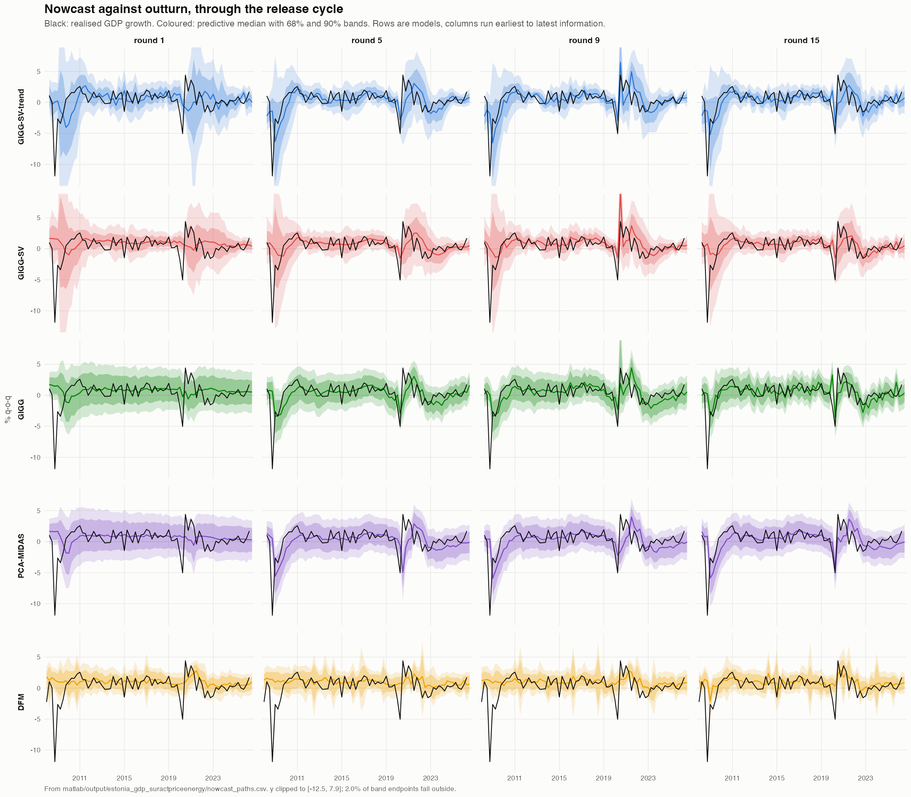{#fig-paths-core}

@fig-paths-core shows the source of the score differences. All five models track the tranquil period closely and all five miss the 2008Q4 and 2020Q2 troughs by a wide margin at every release round. The differences between models are differences in how much uncertainty they attach to those misses rather than differences in the central path.

Two features of @fig-paths-core are worth drawing out, and one of them does not come out as one might expect.

```{r band-table}
#| label: tbl-bands
#| tbl-cap: "Mean width of the ninety per cent predictive interval, in percentage points, by release round."
paths <- d("nowcast_paths.csv")
paths %>%
  filter(spec %in% CORE, release_round %in% c(1, 3, 5, 9, 15)) %>%
  mutate(width = q95 - q05) %>%
  group_by(spec, release_round) %>%
  summarise(width = round(mean(width), 2), .groups = "drop") %>%
  pivot_wider(names_from = release_round, values_from = width,
              names_prefix = "round ") %>%
  arrange(factor(spec, levels = CORE)) %>%
  rename(Model = spec) %>%
  kable()
```

The first is that uncertainty narrows as information accrues, which is the density counterpart of the score profile noted above. For the four MIDAS-family specifications the ninety per cent interval contracts by between a fifth and a quarter between the first and the last round. The dynamic factor model is the exception. Its interval is both much narrower throughout and essentially flat across the cycle, moving from 4.38 to 4.35 percentage points. A model whose predictive uncertainty does not respond to the arrival of three additional months of hard data is not learning from the release calendar in the way the others are, and this is the same limitation that flatters its density scores. The PCA-MIDAS interval is the widest of the MIDAS family at every round, which alongside its point-forecast performance is the second reason to prefer the Almon restriction on this panel.

The second concerns the shape of the crisis-period densities, and here the evidence is weaker than one might expect. Averaged over the 2008 and 2020 trough quarters at the first release round, the distance from the median to the fifth percentile relative to the distance from the median to the ninety-fifth is 1.07 for GIGG-SV and 1.03 for GIGG-SV-trend, against 0.99 for the homoskedastic GIGG. The heteroskedastic specifications do tilt the density towards the downside in crises, but only slightly, and the asymmetry is not large enough to describe as a feature of the model. This is what the specification implies. The observation equation is Gaussian conditional on the volatility state, so any asymmetry can arise only from mixing over parameter and state uncertainty, and that channel is weak. It is direct evidence that the conditional skewness of Estonian growth is not being captured, and we return to it in the extensions.

## Trend, cycle and volatility

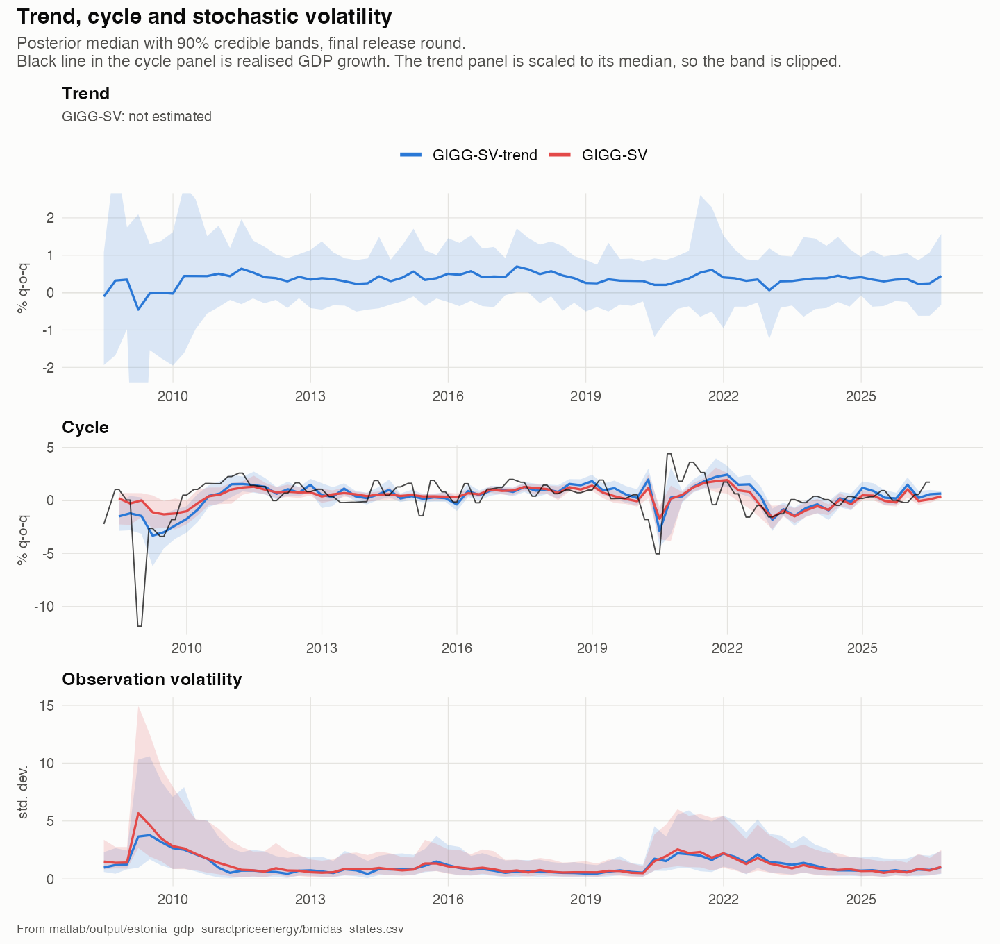{#fig-trend-core}

The trend estimated by GIGG-SV-trend is close to constant at approximately 0.4% per quarter over the entire sample, with a credible band that never excludes a flat trend after 2011. This is consistent with the score evidence, where dropping the trend costs little on the point forecast, however improves density nowcasts because it allows to more flexibly model the uncertainty propagation.

The cycle carries essentially all of the variation and the two models agree on it closely. The observation volatility rises sharply in 2008 and 2009, falls to a low and stable level through the 2010s, and rises again through 2020 to 2022 without approaching the crisis peak. GIGG-SV assigns systematically higher volatility than GIGG-SV-trend in the crisis episode, which is the expected consequence of removing the trend. Variation that the trend would otherwise absorb is reallocated to the variance of the observation equation.

## Inclusion probabilities {#sec-inclusion}

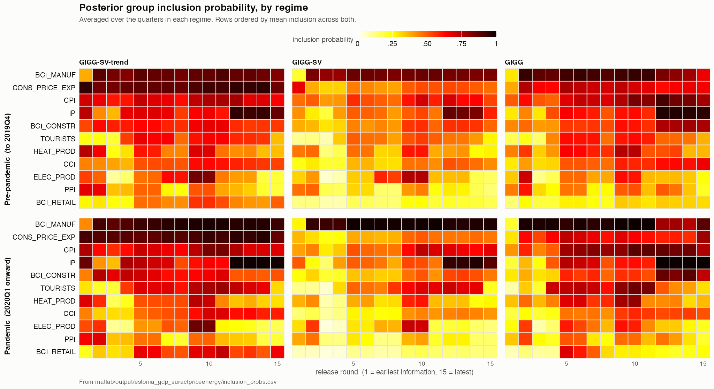{#fig-incl-core}

```{r incl-table}
#| label: tbl-incl
#| tbl-cap: "Group inclusion probabilities at the final release round, full sample."
incl %>%
  filter(spec %in% c("GIGG-SV-trend","GIGG-SV","GIGG"),
         subsample == "Full", release_round == 15) %>%
  mutate(prob = round(prob, 2)) %>%
  select(spec, indicator, prob) %>%
  pivot_wider(names_from = spec, values_from = prob) %>%
  arrange(desc(`GIGG-SV`)) %>%
  rename(Indicator = indicator) %>%
  kable()
```

As indicated above, we use a sparsification algorithm proposed in @kohns2025midas in order to identify which indicator over the nowcast cycle influences the nowcasts the most. The result of applying the sparsification algorithm is a number for every nowcast period for each indicator between 0 and 1 (hence, we often refer to it in the paper as an inclusion probability). The closer this number gets to 1, the more important that indicator is in forming the nowcast.

The three GIGG-MIDAS variants agree on which indicators matter. Industrial production and manufacturing confidence carry the highest probabilities at the final release round, and the consumer price index and consumer price expectations follow. Energy production and tourism are selected least often. This is a coherent reading for an economy in which manufacturing dominates the goods-export base.

The pattern across the release cycle is more informative than the level. At early rounds, when no hard activity data are available, the survey and price groups carry the entire signal. Industrial production enters only from the rounds at which its first month becomes observable, and its probability then rises monotonically. The model reallocates weight from soft to hard information as the latter arrives, which is the behaviour the group structure was designed to produce.

It is useful to attach calendar time to those rounds. Rounds one to four fall in the first month of the target quarter, roughly four months before the flash release. Rounds five to eight fall in the second month and rounds nine to twelve in the third, roughly three and two months ahead. Rounds thirteen to fifteen fall in the month after the quarter closes, within about a month of publication. Industrial production first enters at round four, so the switch from soft to hard information begins around four months before the outturn is published and is complete only in the final month of the cycle.

Interestingly, there is fairly little difference in the inclusion probabilities before and during the pandemic, whereas for the UK data nowcasting application in @kohns2025midas, there was a clear difference variable importance pre- to during the pandemic. This may suggest that Estonia's economy wasn't majorly affected by Covid in the sense of which economic drivers affect GDP growth most.

In line with our previous paper, we find that there is clear evidence of sparsity, and that it varies over the release cycle. Especially when industrial production is sufficiently available, we see that this indicator received most weight while other variables are more heavily shrunk and therefore receive lower inclusion probability. This may also explain the superior performance in mean predictions of the MIDAS models over the DFM model which per modeling assumption assumes that the signal of the data is dense. Interestingly, we see that the signal sparsity clearly depends on whether SV and or the trend are modeled.

## Live nowcast

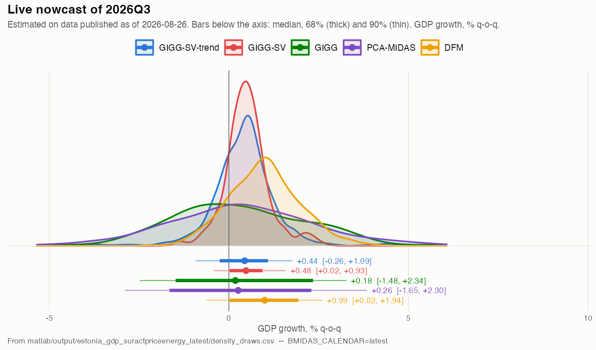{#fig-live-core}

@fig-live-core reports nowcasts for 2026Q3 conditioned on all data published to date. The BMIDAS variants are estimated on the live calendar and therefore observe a single information set rather than a sequence of rounds. GIGG-SV places the median at 0.48% eight per cent with a 60% interval from 0%-0.9% growth. In line with the above discussion, we find the interval larger for the GIGG-SV-trend and for the GIGG model, however the medians fairly closely agree. The dynamic factor model is more optimistic at plus 0.99% at the median, however with larger uncertainty.

# Extending the dataset {#sec-extending}

## Financial market data

The core panel contains no financial information. Financial market data are the only series available with no publication delay, and their usefulness in mixed-frequency models is established [@andreou2013should]. Hence, on hypothesis is that the financial data may meaningfully improve nowcasts in the early nowcast rounds.

Five series are added from the European Central Bank Data Portal. These are the EURO STOXX 50 index, the three-month Euribor rate, the spread of the euro area ten-year benchmark bond yield over that rate, the United States dollar to euro exchange rate, and the Estonian lending rate to non-financial corporations. Rates enter in first differences and prices in percentage changes. The spread enters in levels.

The timing convention deserves a comment. The series enter as monthly averages of daily observations, so a month's value is complete only at month end. They therefore carry a publication delay of zero but sit one slot behind the survey balances, which are published on the 23. of each month. This is truthful for a monthly average and it also forgoes the main advantage of the data. A month-to-date average would make this the most timely block in the panel rather than the second most timely (which we leave to future research).

## Foreign activity

Approximately 46% cent of Estonian goods exports go to Finland, Sweden, Latvia and Germany. Foreign demand is summarised by a single export-weighted index of harmonised industrial confidence in those four economies, taken from Eurostat and seasonally adjusted at source.

```{r foreign-weights}
#| label: tbl-weights
#| tbl-cap: "Export weights for the foreign activity index, from Statistics Estonia partner shares."
d("foreign_diagnostics.csv") %>%
  mutate(across(c(mean_share_pct, weight), ~ round(.x, 3))) %>%
  select(Country = country, `Share of goods exports, per cent` = mean_share_pct,
         Weight = weight) %>%
  kable()
```

Weights are fixed at the mean partner share over the full period for which Statistics Estonia publishes them. A time-varying weight would have to be lagged to remain consistent with real time and would rewrite the historical index at every vintage (hence, also left for future iterations of this project).

Two design choices are worth recording. The harmonised surveys are taken from Eurostat rather than from the OECD, because the OECD mirror of the same series runs one month behind. Foreign industrial production is available but is not used, because it carries the same two-month delay as Estonian industrial production and therefore is unlikely to improve the early rounds where the core panel is weakest.

## Results

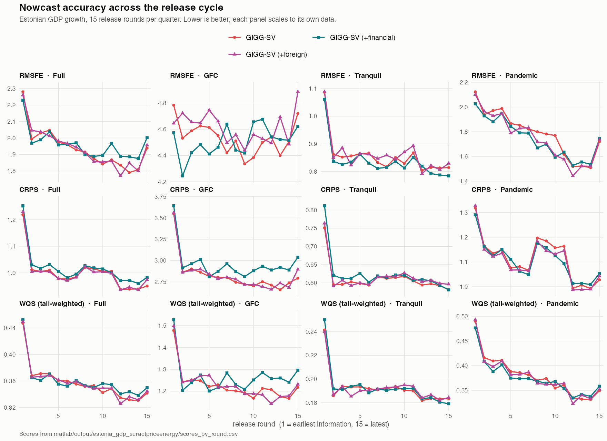{#fig-scores-panels}

```{r panel-scores}
#| label: tbl-panels
#| tbl-cap: "GIGG-SV across indicator panels, scores averaged over release rounds."
sub_scores %>%
  filter(spec %in% PANELS, subsample %in% c("Full","GFC","Tranquil","Pandemic")) %>%
  select(spec, subsample, rmsfe, crps) %>%
  pivot_longer(c(rmsfe, crps), names_to = "metric") %>%
  mutate(metric = toupper(metric), value = round(value, 3)) %>%
  pivot_wider(names_from = subsample, values_from = value) %>%
  arrange(factor(metric, levels = c("RMSFE","CRPS")), factor(spec, levels = PANELS)) %>%
  rename(Panel = spec, Metric = metric) %>%
  kable()
```

Neither extension improves the full-sample score significantly. The differences in @tbl-panels are within the Monte Carlo variation of the estimation procedure. The informative variation lies across release rounds rather than in the averages.

Financial data improve the earliest rounds and worsen the latest. Full-sample root mean squared error at round one falls from 2.280 to 2.229 when the financial block is added, and at round fifteen it rises from 1.939 to 2.002. The mechanism is visible in the inclusion probabilities. At round one the financial block occupies the top three positions, with the term spread at zero point six two, the exchange rate at zero point five two and the three-month rate at zero point five two, ahead of every survey balance. Financial variables substitute for hard data that has not yet arrived and muddy the signal once it has.

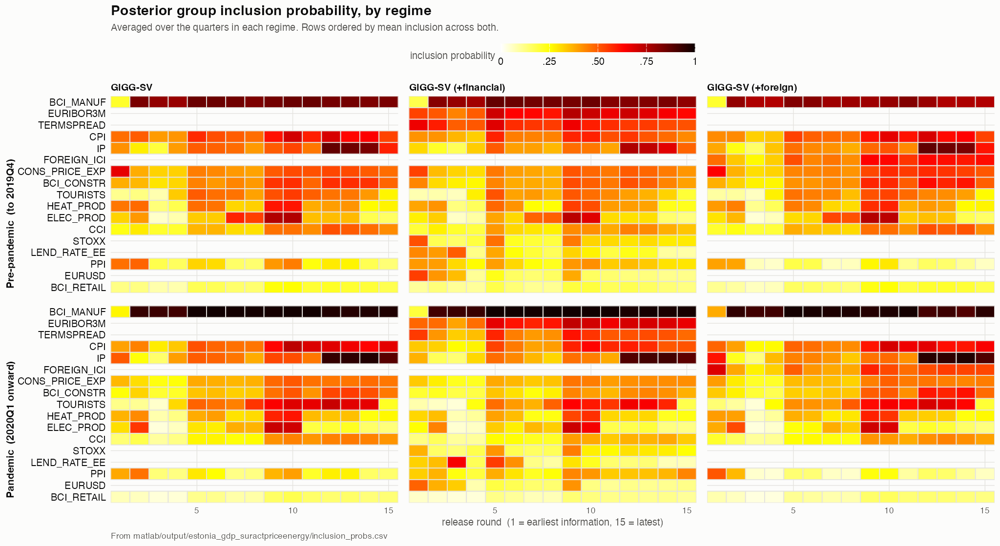{#fig-incl-panels}

Foreign activity does not help on any subsample and is the weakest of the three panels in the crisis period, at `r val("GIGG-SV (+foreign)","GFC","rmsfe")` against `r val("GIGG-SV","GFC","rmsfe")` for the core panel. The index is selected when it is available, at an inclusion probability of 0.55 and second rank of twelve at round one.

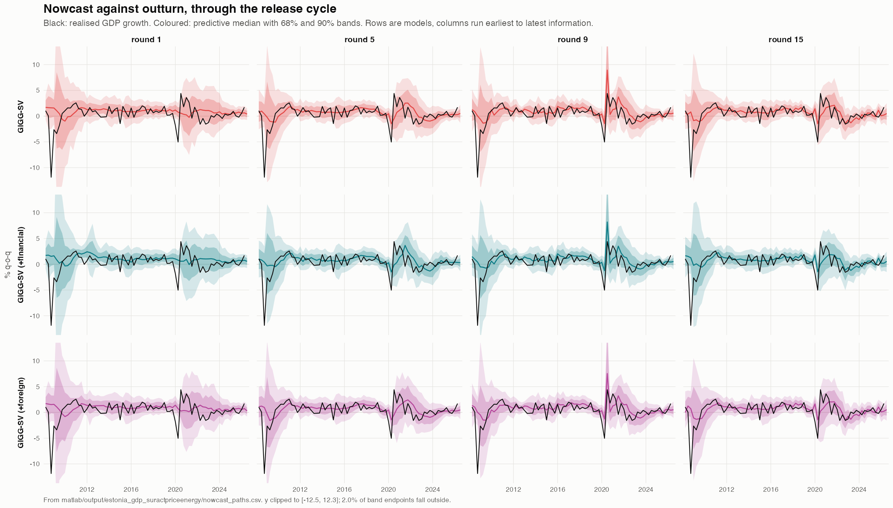{#fig-paths-panels}

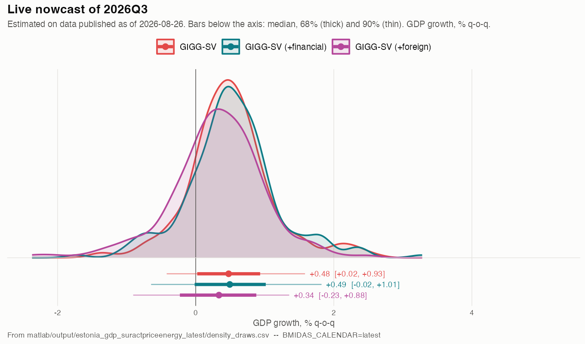{#fig-live-panels}

In line with the results, the live nowcasts in @fig-live-panels don't differ meaningfully across panels.

# Summary

In this case study, we have applied the MIDAS-GIGG toolbox proposed by @kohns2025midas applied to a new data source for nowcasting real GDP growth of Estonia. This note is intended to serve as a summary of the main methodology both for data collection and nowcast models which will be made openly available and updated in real time with each data update for Estonia. The hope is that this will improve transparency in modelling and data assumptions for nowcasting aggregate economic activity.

The results show that the MIDAS-GIGG models provide good fit to Estonian data where the GIGG-SV (stochastic volatility in the observation equation) provides a good balance between fit and parsimony. The models also improve significantly over commonly used competitors, the DFM and the PCA-MIDAS method.

Certaintly there are many improvements we can make on the breadth of data as well as modelling assumptions. If you have any comments, suggestions or questions, do please feel free to reach out to me. I summarise some planned work for this project below.

# Future extensions

**Calibration and skewness.** The scores reported here summarise the predictive density by its distance from a realisation. They do not establish whether the densities are calibrated. Probability integral transforms and their tail behaviour would establish this directly [@gneiting2007strictly]. The evidence in @sec-core that a homoskedastic model attains the best crisis-period continuous ranked probability score suggests that the symmetric volatility specification is not capturing the shape of the predictive distribution during downturns. Asymmetry in the conditional distribution of growth is a plausible missing feature.

**Financial data in the variance rather than the mean.** Financial variables improve the early nowcast rounds and degrade the late ones when they enter the conditional mean. Their established role in the literature on growth at risk is in the conditional variance and in the lower quantiles. Allowing them to load on the volatility state or on a skewness parameter, rather than on the mean, is a more natural use of what they carry.

**Panel extension to Latvia and Lithuania.** The three Baltic economies many similarities a common set of external shocks and are individually short of data. A panel specification with partial pooling across countries would address the sample length problem identified above directly, rather than by discarding the crisis episode.

**Non-standard data sources.** Internet search data improve nowcasts early in a quarter, before conventional indicators become available [@kohns_nowcasting_2022], which is precisely where the models here are weakest. Card payment records, electricity load and port traffic are further candidates with short publication delays.

# Appendix {.unnumbered}

## Dynamic factor model decomposition {#sec-appendix-dfm .unnumbered}

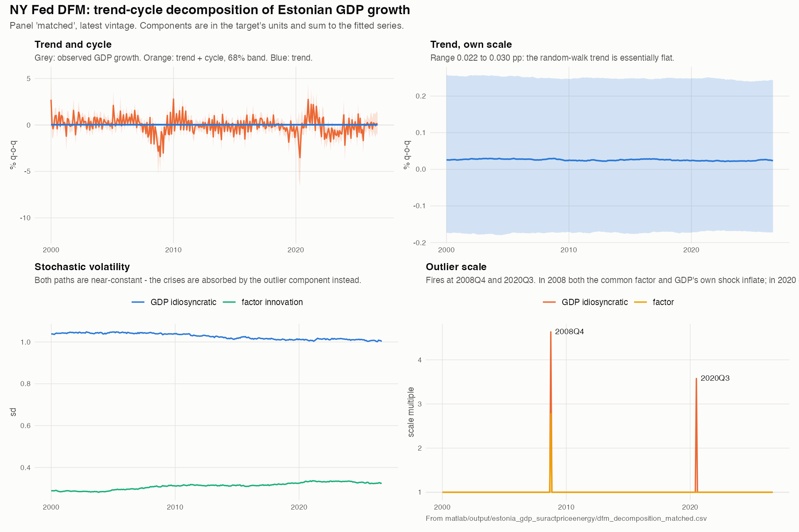{#fig-dfm-decomp}

@fig-dfm-decomp supports the reading of the factor model given in @sec-core. The random-walk trend is flat to three decimal places. Both stochastic volatility paths, on the common factor and on the target's own innovation, are close to constant across twenty-six years. The crisis episodes are handled instead by the discrete outlier scale in the lower right panel, which multiplies the innovation standard deviation and is exactly one everywhere except at 2008Q4 and 2020Q3. In 2008 both the common factor and the target's own shock inflate. In 2020 only the target's own shock does, which is consistent with a shock that hit measured Estonian output without a corresponding common movement in the monthly indicators.

The consequence for the comparison in @tbl-dm is that the factor model is close to homoskedastic between the two spikes. Its density is well calibrated in quiet periods, which is where its significant continuous ranked probability score advantage lies, and poorly suited to the crisis quarters, where it scores worse than the homoskedastic GIGG.

# Original computing environment {.unnumbered}

```{r session}
#| code-fold: true
sessionInfo()
```

# References {.unnumbered}